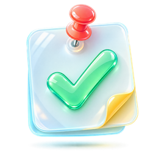
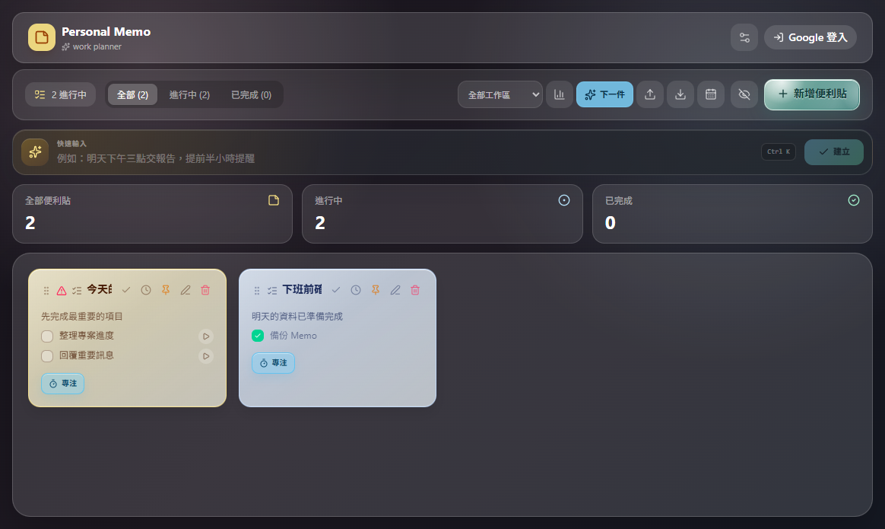
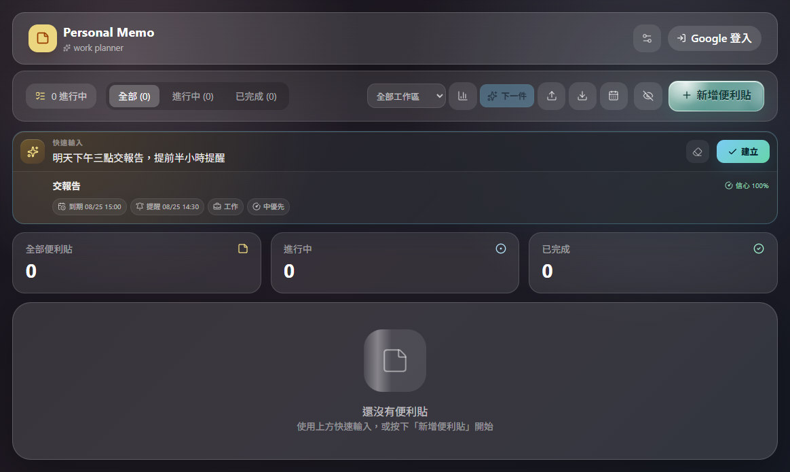
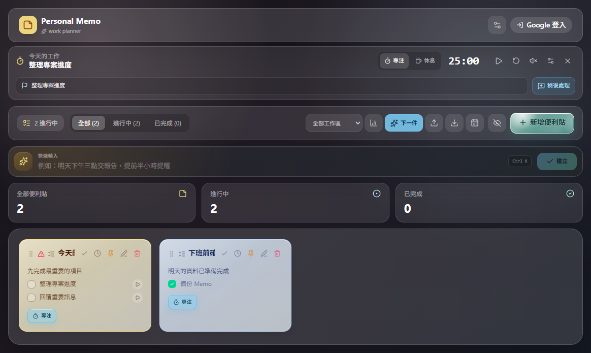
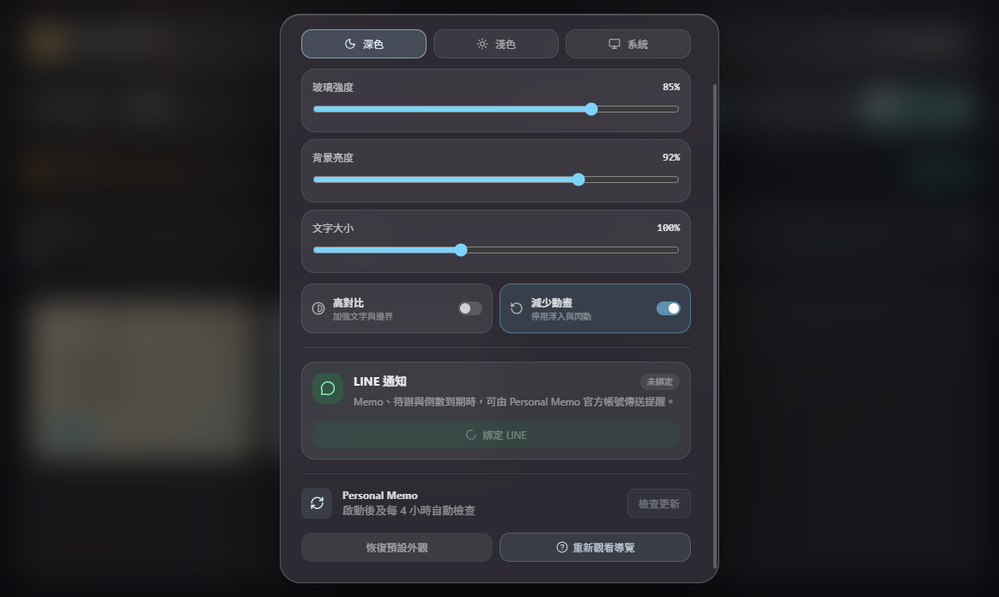

  

<h1 align="center">Personal Memo</h1>

  整合桌面便利貼、待辦、倒數提醒與專注節奏的工作規劃工具。

  <a href="https://github.com/lk242/personal-memo-releases/releases/latest"><strong>下載最新版本</strong></a>

## 主要功能

### 一般便利貼與待辦

使用一般便利貼管理工作與個人事項，可加入多筆待辦、期限、提醒、優先級與工作區。便利貼能獨立釘在桌面、調整大小與透明度，並鎖定位置避免誤拖。

### 快速輸入

直接輸入「明天下午三點交報告，提前半小時提醒」，程式會在本機解析日期、時間、提醒、工作區與優先級。模糊內容會先要求確認，不會直接建立錯誤提醒。

### 專注模式

從「下一件」或單張 Memo 開始專注計時，可調整專注與休息時間、記錄本輪目標，並把臨時想到的事情先放進專注收件匣。環境音與工作音樂可自行開關。

### LINE 到期提醒

在設定中完成 LINE 綁定後，即使 Personal Memo 沒有開啟，也能由雲端排程傳送到期提醒。綁定後可測試通知，或暫停 LINE 提醒而不解除帳號。

### 自動更新

程式會在啟動後與每 4 小時自動檢查版本。有新版時，右上角會顯示更新提示；按一次即可下載、安裝並重新啟動。更新後會保留既有 Memo、桌面位置與外觀設定。

## 第一次使用

1. 跟著十步新手導覽認識快速輸入、便利貼、專注模式、LINE 綁定與更新。
2. 使用「新增便利貼」建立 Memo，或在快速輸入列輸入自然語句。
3. 加入待辦項目，設定整張 Memo 或個別待辦的到期時間。
4. 需要常駐桌面時，按圖釘並視需要鎖定位置。
5. 按「下一件」開始專注計時。
6. 到「設定 > LINE 通知」完成綁定與測試通知。
7. 之後可從設定重新觀看完整導覽。

## 安裝與更新

1. 前往 [最新 Release](https://github.com/lk242/personal-memo-releases/releases/latest)。
2. 下載 `Personal-Memo-Setup-x.y.z.exe`。
3. 執行安裝程式並選擇安裝位置。
4. 後續版本可直接使用程式右上角的更新提示。

目前安裝檔尚未購買程式碼簽章憑證，Windows SmartScreen 可能顯示未知發行者。請只從本 repo 的 Releases 下載，並使用 Release 提供的 SHA-256 核對檔案。

## 系統需求

- Windows 10 或 Windows 11，x64。
- macOS 12 以上的程式架構已支援；目前公開 Release 先提供 Windows Setup。
- 離線時仍可使用 Memo、快速輸入與專注功能。
- LINE 通知、登入同步與版本更新需要網路連線。

## 隱私與授權

- 本 repo 僅作為官方下載與產品介紹頁，不包含應用程式原始碼或素材檔案。
- 公開展示畫面只使用一般便利貼與測試資料，不包含使用者內容。
- Firebase 公開設定不等於資料庫權限；實際存取仍由登入狀態與安全規則限制。
- LINE 憑證存放於 Cloudflare Secrets，桌面裝置憑證使用 Windows DPAPI 或 macOS Keychain 保護。
- Personal Memo 與其原始程式碼、音訊及原創素材未採用開源授權，保留所有權利。

## 問題回報

若遇到安裝、提醒或畫面排版問題，請在本 repo 建立 Issue，並附上 Windows 版本、Personal Memo 版本及畫面截圖。
