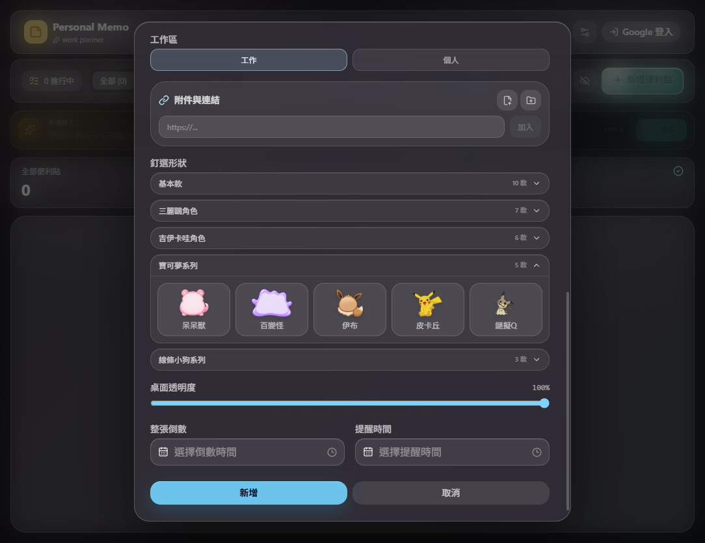
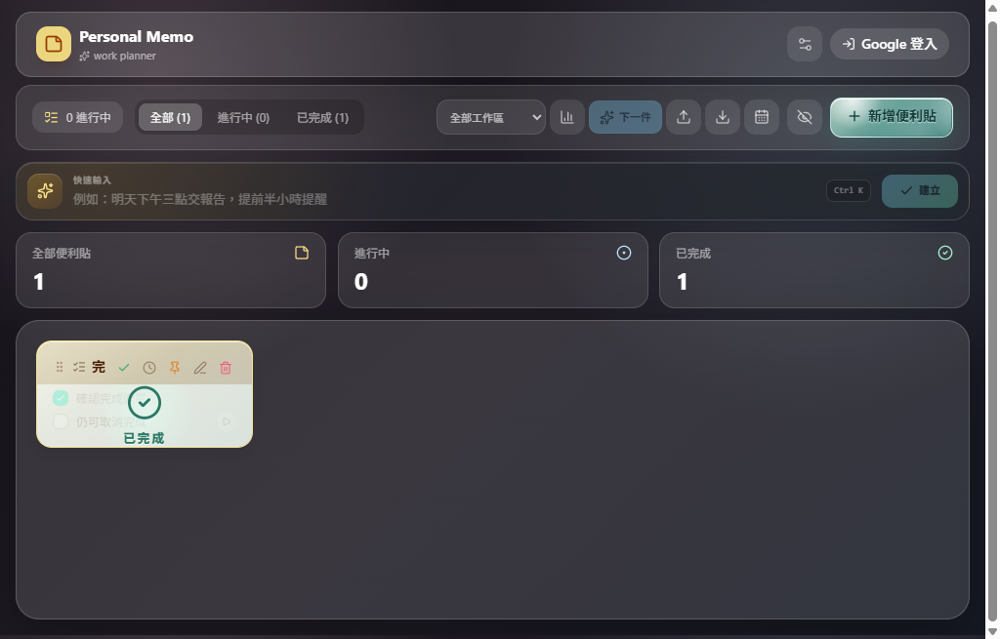

  

<h1 align="center">Personal Memo</h1>

  一款以琉璃便利貼、角色造型與專注節奏為核心的桌面工作規劃工具。

  <a href="https://github.com/lk242/personal-memo-releases/releases/latest"><strong>下載最新版本</strong></a>

## 設計概念

Personal Memo 把待辦清單、倒數提醒與桌面便利貼整合在同一個工作空間。介面採用半透明琉璃材質、柔和光影與角色造型，讓提醒保持清楚，但不會像傳統工作軟體一樣生硬。

- 主畫面管理所有 Memo、待辦、倒數與工作區。
- 桌面便利貼可以固定在工作畫面旁，並鎖定位置避免誤拖。
- 長文字使用跑馬燈，不會為了內容自動撐大便利貼。
- 完成後顯示明確遮罩、勾選圖示與「已完成」。
- 外觀設定會同步調整整個程式的文字大小、亮度與玻璃強度。

## 主要功能

### 快速輸入

直接輸入「明天下午三點交報告，提前半小時提醒」，程式會在本機解析日期、時間、提醒、工作區與優先度。低信心或模糊內容會要求確認，不會直接建立錯誤提醒。

### 角色與琉璃外觀

可切換顏色與角色造型；主題選單一次只展開一組，避免設定面板過長。角色便利貼使用獨立文字安全區，並針對輪廓與控制按鈕做版面檢查。

### 清楚的完成狀態

Memo 完成後會以遮罩與大型勾選圖示呈現，仍保留頂部操作列，方便取消完成或繼續編輯。

### LINE 到期提醒

綁定 LINE 後，即使 Personal Memo 沒有開啟，也能由 Cloudflare 排程傳送到期提醒。訊息可直接完成或延後 10 分鐘，設定內也可以暫停 LINE 提醒而不解除綁定。

### 專注模式與音樂

每張 Memo 都能啟動專注計時，搭配內建環境音與音樂。倒數、桌面通知與 LINE 提醒會共用同一份工作狀態。

### BETA 桌寵

桌寵與告示牌是兩個獨立桌面物件。角色會在告示牌周圍活動，也能被單獨拖曳到桌面其他位置，之後自行散步或返回。桌寵支援小、中、大三種尺寸；Windows 桌面項目被刪除後，附近的桌寵會跑到刪除位置播放吃與吞嚥動畫。

## 最新版本

### v1.8.6

- 咕嘎、Doro、菲比補上誇張張嘴吃檔案動畫，與糯糯使用一致的桌面刪除互動表現。
- 修正 Doro 吞嚥動畫的身體缺格，並保留完整頭髮、帽子、衣服與四肢輪廓。
- 四款大型桌寵皆納入桌面刪除、拖曳、漫遊、返回與四種檔案互動回歸測試。
- Windows Setup SHA-256：`E1511DC087CE9A5F9315E6D10746BA2FB972DFB3EAD680F6965046B3363C6BE7`

### v1.8.5

- 新增四款 BETA 桌寵、獨立拖曳、桌面漫遊、情緒反應與尺寸設定。
- 新增桌面檔案刪除反應，以及吃、吞嚥、拒絕、吐回動畫。
- 放大桌寵系列告示牌，修正角色與告示牌圖層、文字安全區及完成遮罩。
- Windows Setup SHA-256：`1696BAE73CB76D57FBDB15CFE30F7F68112B2C83A4EADF4D48BB8BA4ACF5584F`

## 基本操作

1. 使用「新增便利貼」建立 Memo，或在快速輸入列輸入自然語句。
2. 加入待辦項目，為整張 Memo 或個別待辦設定到期時間。
3. 需要常駐桌面時，開啟桌面便利貼並視需要鎖定位置。
4. 點擊「專注」開始計時，從音樂面板選擇背景聲音。
5. 到「設定 > LINE 通知」完成綁定、測試通知及提醒開關設定。
6. 第一次使用可跟著九步新手導覽操作，也能從設定重新播放。

## 系統需求

- Windows 10 或 Windows 11，x64。
- macOS 12 以上的程式架構已支援；目前公開 Release 先提供 Windows Setup。
- 離線時仍可使用 Memo、快速輸入、角色外觀與專注功能。
- LINE 通知與 Firebase 同步需要網路連線。

## 安裝說明

1. 前往 [Releases](https://github.com/lk242/personal-memo-releases/releases/latest)。
2. 下載 `Personal Memo Setup x.y.z.exe`。
3. 執行安裝程式並選擇安裝位置。

目前安裝檔尚未購買程式碼簽章憑證，Windows SmartScreen 可能顯示未知發行者。請從本 repo 的 Releases 下載，並可使用 Release 說明提供的 SHA-256 核對檔案。

## 隱私與授權

- 本 repo 僅作為官方下載與產品介紹頁，不包含應用程式原始碼、音訊或角色素材。
- Firebase 公開設定不等於資料庫權限；實際存取仍由登入狀態與安全規則限制。
- LINE 憑證存放於 Cloudflare Secrets，桌面裝置憑證使用 Windows DPAPI 或 macOS Keychain 保護。
- Personal Memo 與其原始程式碼、音訊及原創素材未採用開源授權，保留所有權利。
- BETA 桌寵系列包含尚未取得商業授權的社群二創角色素材，只供非商業測試；不代表已取得原角色權利人的授權。

## 問題回報

若遇到安裝、提醒或畫面排版問題，請在本 repo 建立 Issue，並附上 Windows/macOS 版本、Personal Memo 版本及畫面截圖。
